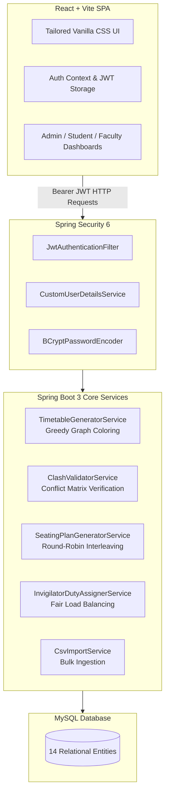

# 🎓 Automated Exam Seat & Duty Allocation System

An automated university examination management platform built with **Spring Boot 3 (Java 17)**, **MySQL**, and **React (Vite)**. The system eliminates examination clashes, prevents exam malpractice via seating interleaving, and fairly balances faculty invigilation duties using combinatorial graph and round-robin algorithms.

---

## 📌 Features & Core Capabilities

- **Conflict-Free Timetable Generation (Graph Coloring)**:
  Constructs a course conflict graph where vertices represent courses and edges indicate shared student enrollments. Uses greedy graph coloring to assign non-conflicting exam dates and sessions (Forenoon `FN` / Afternoon `AN`).

- **Anti-Cheating Seating Plan (Round-Robin Interleaving)**:
  Allocates students into examination halls (rows × columns) by alternating students from different courses in adjacent seats. Ensures no two students writing the same exam sit next to or immediately around each other.

- **Fair Invigilator Duty Assignment**:
  Distributes invigilation duties across faculty members using a least-loaded greedy strategy. Automatically enforces constraints:
  - Subject department exclusion (faculty cannot invigilate their own department's exam).
  - Pre-marked faculty leave/unavailable dates.
  - Maximum daily and weekly duty limits.
  - One-click duty replacement workflow for emergency faculty absences.

- **Role-Based Access Control (RBAC)**:
  - **ADMIN**: Uploads data via CSV, triggers generation algorithms, inspects clash matrices, monitors hall allocations, and manages faculty duties.
  - **STUDENT**: Logs in to view personalized exam timetable with assigned hall and desk number.
  - **FACULTY**: Logs in to view invigilation schedule, hall assignments, and submit unavailable dates.

- **Clean Engineering Practices**:
  - No Lombok magic: 100% hand-crafted getters, setters, and constructors for clarity and interview readiness.
  - Granular, user-friendly exception handling (`ClashDetectedException`, `NotEnoughHallsException`, etc.).
  - 22 comprehensive JUnit 5 tests for algorithmic edge cases.

---

## 🏗️ System Architecture



---

## 💻 Tech Stack

| Layer | Technology | Description |
|---|---|---|
| **Backend** | Java 17, Spring Boot 3.2 | Core REST API framework |
| **Persistence** | Spring Data JPA, Hibernate | ORM and relational mappings |
| **Security** | Spring Security 6, JJWT (0.11.5) | Stateless JWT authentication & RBAC |
| **Database** | MySQL 8.x | Relational storage with foreign key constraints |
| **Frontend** | React 18, Vite | Component-driven Single Page Application |
| **Routing** | React Router v6 | Client-side routing with `ProtectedRoute` guards |
| **Styling** | Vanilla CSS3 (Custom Design System) | Modern glassmorphism, responsive grid & card layouts |
| **Testing** | JUnit 5, Mockito | Service-level business logic testing |

---

## 🧮 Algorithmic Breakdown

### 1. Timetable Scheduling (Greedy Graph Coloring)
- **Problem**: Given a set of courses $C$ and student enrollments, assign each course to an exam slot $(Date, Session)$ such that no student has two exams in the same slot.
- **Solution**:
  1. Build an adjacency conflict graph $G = (V, E)$ where vertex $v \in V$ is a course, and $(u, v) \in E$ if $\exists$ student enrolled in both $u$ and $v$.
  2. Order vertices by degree descending (largest degree first heuristics).
  3. Greedily assign the earliest available color (slot index) not occupied by any neighbor.
  4. Map slot indices to actual academic calendar dates (FN: 09:30–12:30, AN: 14:00–17:00).

### 2. Seating Plan (Round-Robin Cross-Course Interleaving)
- **Problem**: Prevent cheating by ensuring adjacent desks do not seat students writing the same course paper.
- **Solution**:
  1. Retrieve all courses scheduled in a specific slot.
  2. Collect all enrolled students grouped by course into distinct FIFO queues.
  3. Traverse hall desks sequentially: Row 1 (Seat 1..C), Row 2 (Seat 1..C), etc.
  4. Round-robin cycle through course queues ($C_1 \rightarrow C_2 \rightarrow C_3 \dots$), dequeuing one student per seat.
  5. If one course queue empties first, continue interleaving remaining courses across halls.

### 3. Invigilator Duty Assignment (Constraint-Satisfaction & Load Balancing)
- **Problem**: Distribute $M$ exam sessions across $N$ faculty members fairly without department bias or time conflicts.
- **Solution**:
  1. Filter out faculty on approved leave for the session date.
  2. Filter out faculty belonging to the course's department (e.g. CSE faculty cannot invigilate CSE core papers).
  3. Sort remaining candidate faculty by `currentAssignedDuties` ascending.
  4. Assign the faculty with the lowest load and increment their counter.

---

## 📁 Project Directory Structure

```text
Exam seat allocation system/
├── data/                               # Sample dataset for demonstration
│   ├── students.csv                    # 24 students across CSE, ISE, ECE
│   ├── courses.csv                     # 7 courses mapped to faculty IDs
│   ├── enrollments.csv                 # 72 student-course enrollments
│   └── seed_data.sql                   # SQL seed script for halls & faculty
├── frontend/                           # React + Vite application
│   ├── index.html                      # HTML5 entry with Outfit / Inter fonts
│   ├── package.json                    # Frontend dependencies
│   ├── vite.config.js                  # Vite configuration & proxy
│   └── src/
│       ├── components/                 # NavigationBar, HallSeatGrid, StatCard...
│       ├── context/                    # AuthContext (JWT & user state)
│       ├── pages/                      # AdminDashboard, Timetable, Seating, Login...
│       ├── services/                   # Axios API service clients
│       └── styles/                     # Scoped CSS modules & theme variables
├── src/                                # Spring Boot Java Backend
│   ├── main/
│   │   ├── java/com/suhas/examallocation/
│   │   │   ├── config/                 # SecurityConfig, CorsConfig, DataSeeder
│   │   │   ├── controller/             # 9 REST Controllers (Admin, Student, Faculty)
│   │   │   ├── dto/                    # Request/Response Data Transfer Objects
│   │   │   ├── exception/              # GlobalExceptionHandler & custom exceptions
│   │   │   ├── model/                  # 14 JPA Entities (Hall, Exam, SeatAllocation...)
│   │   │   ├── repository/             # 11 Spring Data Repositories
│   │   │   ├── security/               # JwtTokenProvider, JwtAuthenticationFilter
│   │   │   └── service/                # Graph coloring, seating, duty services
│   │   └── resources/
│   │       └── application.properties  # Database URL, JPA, and JWT properties
│   └── test/                           # 22 JUnit 5 service test cases
├── .gitignore
├── pom.xml                             # Maven project dependencies
└── README.md
```

---

## 🚀 Getting Started

### Prerequisites
1. **Java Development Kit (JDK 17 or higher)**
   - Verify: `java -version`
2. **Apache Maven 3.8+**
   - Verify: `mvn -version`
3. **Node.js (v18+) & npm (v9+)**
   - Download: [nodejs.org](https://nodejs.org/)
   - Verify: `node -version` and `npm -version`
4. **MySQL Server 8.x**
   - Ensure MySQL service is running on port `3306`.

---

### Step 1: Database Setup

Log into MySQL shell or MySQL Workbench and create the database:

```sql
CREATE DATABASE IF NOT EXISTS exam_allocation;
```

Check `src/main/resources/application.properties` and verify your MySQL username and password:

```properties
spring.datasource.url=jdbc:mysql://localhost:3306/exam_allocation?createDatabaseIfNotExist=true&useSSL=false&serverTimezone=UTC
spring.datasource.username=root
spring.datasource.password=root
spring.jpa.hibernate.ddl-auto=update
```

---

### Step 2: Run the Backend

Open a terminal in the project root:

```bash
# Clean and run with Maven
mvn spring-boot:run
```

On first startup, `DataSeeder.java` will automatically:
- Create the default `admin` account
- Seed 3 examination halls (`LH-101`, `LH-102`, `LH-201`)
- Seed 4 faculty members across departments
- Create default `faculty1` and `student1` accounts

The backend will start at: `http://localhost:8080`.

---

### Step 3: Run the Frontend

Open a second terminal inside the `frontend` folder:

```bash
cd frontend
npm install
npm run dev
```

The frontend development server will launch at: `http://localhost:5173`.

---

## 🔑 Default Login Credentials

| Role | Username | Password | Purpose |
|---|---|---|---|
| **Admin** | `admin` | `admin123` | Complete administrative control & generation |
| **Faculty** | `faculty1` | `faculty123` | View assigned duties & mark unavailable dates |
| **Student** | `student1` | `student123` | View personalized exam dates, halls, and seats |

---

## 🧪 End-to-End Workflow Demonstration

Follow these steps to demonstrate the full system capabilities:

1. **Log in as Admin**: Navigate to `http://localhost:5173` and sign in with `admin` / `admin123`.
2. **Import Sample Dataset**:
   - Go to **Import Data** in the navigation bar.
   - Upload `data/students.csv` (24 students registered).
   - Upload `data/courses.csv` (7 courses mapped to faculty).
   - Upload `data/enrollments.csv` (72 student enrollments).
3. **Generate Timetable**:
   - Navigate to **Timetable**.
   - Pick a starting date (e.g. next Monday) and click **Generate Timetable**.
   - The greedy graph coloring engine schedules all 7 courses with 0 clashes.
   - Click **Run Clash Check** to verify 0 conflict edge violations.
4. **Generate Seating Plan**:
   - Navigate to **Seating Plan** and click **Generate Seating Plan**.
   - Select a slot to inspect the visual 2D seating grid. Notice how CSE and ISE students are interleaved across desks.
5. **Assign Invigilator Duties**:
   - Navigate to **Duty Chart** and click **Assign Duties**.
   - Inspect the duty chart table showing load-balanced assignments with department exclusions respected.
6. **Verify Student View**:
   - Log out and log in as `student1` / `student123`.
   - The student sees only their enrolled subjects, exam dates, sessions, halls, and specific seat numbers.
7. **Verify Faculty View**:
   - Log out and log in as `faculty1` / `faculty123`.
   - The faculty member sees their invigilation schedule and can submit leave dates.

---

## 📡 Complete REST API Reference

### Authentication
| Method | Endpoint | Access | Description |
|---|---|---|---|
| `POST` | `/api/auth/login` | Public | Authenticates credentials and returns JWT token + role |

### Data Import & Management (Admin)
| Method | Endpoint | Access | Description |
|---|---|---|---|
| `POST` | `/api/admin/import/students` | ADMIN | Bulk import students via CSV |
| `POST` | `/api/admin/import/courses` | ADMIN | Bulk import courses via CSV |
| `POST` | `/api/admin/import/enrollments` | ADMIN | Bulk import enrollments via CSV |
| `GET/POST`| `/api/admin/halls` | ADMIN | CRUD operations on examination halls |
| `GET/POST`| `/api/admin/faculty` | ADMIN | CRUD operations on faculty profiles |
| `GET/POST`| `/api/admin/courses` | ADMIN | CRUD operations on course catalog |
| `GET/POST`| `/api/admin/students` | ADMIN | CRUD operations on student records |

### Core Algorithms (Admin)
| Method | Endpoint | Access | Description |
|---|---|---|---|
| `POST` | `/api/admin/timetable/generate` | ADMIN | Triggers graph coloring timetable generation |
| `GET`  | `/api/admin/timetable` | ADMIN | Fetches scheduled timetable rows |
| `GET`  | `/api/admin/timetable/clashes` | ADMIN | Evaluates timetable against enrollment conflict graph |
| `POST` | `/api/admin/seating/generate` | ADMIN | Triggers round-robin seat allocation |
| `GET`  | `/api/admin/seating/hall/{id}/slot/{slotId}` | ADMIN | Returns 2D grid matrix of hall seat allocations |
| `POST` | `/api/admin/duties/generate` | ADMIN | Triggers load-balanced invigilator assignment |
| `GET`  | `/api/admin/duties` | ADMIN | Returns complete duty distribution roster |
| `POST` | `/api/admin/duties/{id}/replace` | ADMIN | Replaces an assigned invigilator with an eligible substitute |

### Self-Service Endpoints
| Method | Endpoint | Access | Description |
|---|---|---|---|
| `GET`  | `/api/student/my-exams` | STUDENT | Returns authenticated student's personalized schedule |
| `GET`  | `/api/faculty/my-duties` | FACULTY | Returns authenticated faculty's duty assignments |
| `POST` | `/api/faculty/unavailable-dates` | FACULTY | Submits an unavailable date constraint |

---

## 🧪 Running Automated Tests

To execute the 22 JUnit 5 test cases covering timetable graph coloring, clash matrix verification, seating plan round-robin allocation, and duty assignment constraints:

```bash
mvn test
```

---

## ☁️ Deployment (Render + Vercel)

### Backend on Render

1. Push this repository to GitHub.
2. In Render, create a **Web Service** from this repository.
3. Use:
   - **Build Command**: `mvn clean package -DskipTests`
   - **Start Command**: `java -jar target/exam-allocation-1.0.0.jar`
4. Add environment variables in Render:
   - `DB_URL` (JDBC URL to your production MySQL)
   - `DB_USERNAME`
   - `DB_PASSWORD`
   - `JWT_SECRET`
   - `CORS_ALLOWED_ORIGIN_PATTERNS` (for example: `https://your-frontend.vercel.app,https://*.vercel.app`)
5. Render will provide `PORT` automatically; backend reads it via `server.port=${PORT:8080}`.

### Frontend on Vercel

1. Import the repository in Vercel.
2. Set **Root Directory** to `frontend`.
3. Set environment variable:
   - `VITE_API_BASE_URL=https://your-backend.onrender.com/api`
4. Deploy. The frontend already reads `VITE_API_BASE_URL` and falls back to `/api` for local development.
5. SPA routing is handled by [`frontend/vercel.json`](d:/Exam%20seat%20allocation%20system/frontend/vercel.json).

---

## 👨‍💻 Author & Academic Attribution

- **Developer**: Suhas (Final Year Engineering Student)
- **Project**: Automated Examination Seat & Invigilator Allocation System
- **Focus Areas**: Java Backend Engineering, Combinatorial Optimization Algorithms, Secure Full-Stack Web Architecture.
